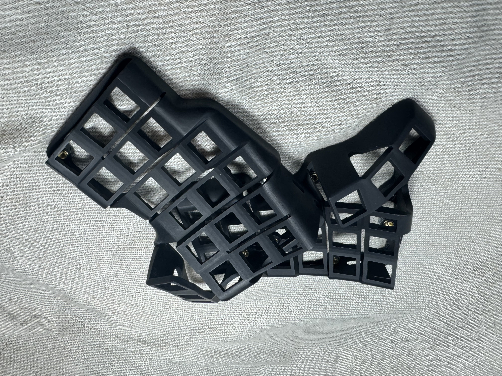
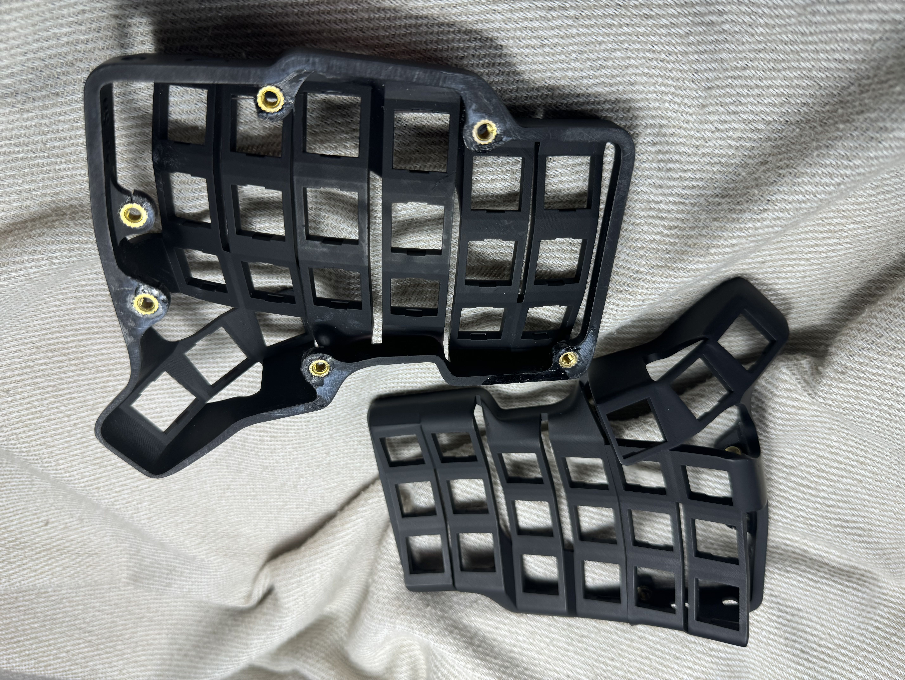
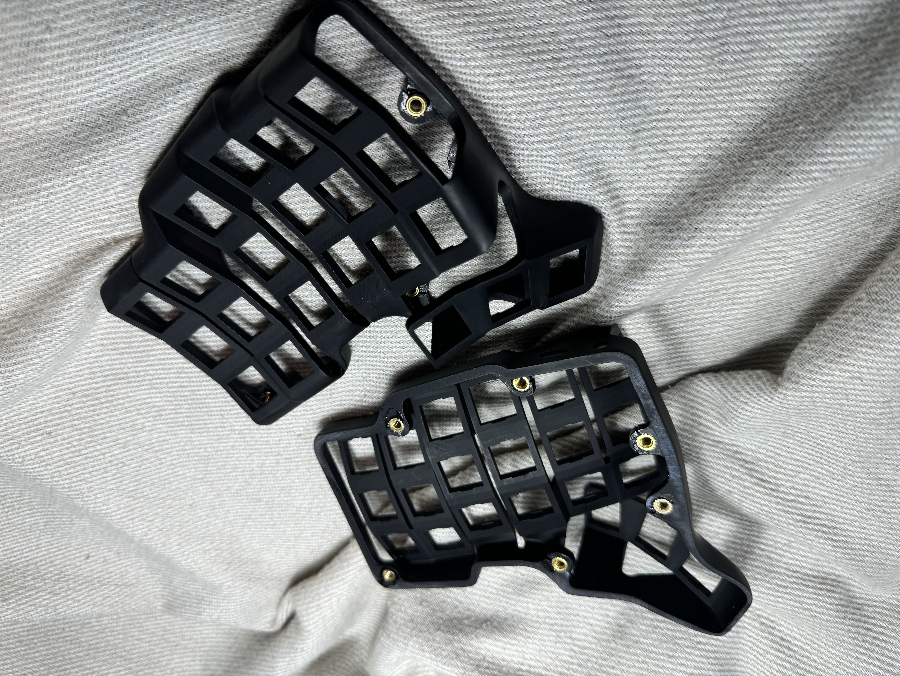
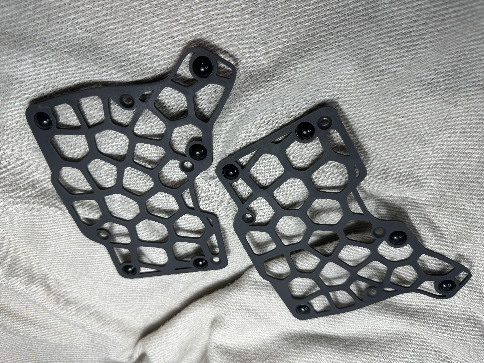

Imagine Black is a standard resin used in SLA (Stereolithography) 3D printing, known for producing high-detail, super smooth parts with a glossy finish. It is particularly good for aesthetic and intricate designs.

## Pros and Cons
### Pros
- High detail and smooth surface finish
- Good for aesthetic and intricate parts
- Glossy appearance

### Cons
- Low mechanical strength
- Brittle and prone to cracking under stress
- Difficult to work with for functional parts requiring inserts

## Keyboard Examples
### Example 1: TBK Mini Keyboard Case
- **Description:** A super smooth, high-detail case for the TBK Mini printed using Imagine Black resin at JLC3D. The case was beautiful initially, but fitting brass inserts was difficult. The resin did not melt when inserting the brass inserts, causing many of the slots to break or crack. This made the process uncomfortable, requiring a lot of time to glue the parts together. Additionally, the case did not sit flat once assembled, likely due to deformation from the inserted nuts.

- **Photos:** 

- **Source:** [BastardKB](https://github.com/Bastardkb/TBK-Mini)

## Printing Settings
- **Layer Height:** N/A (Printed at JLC3D)
- **Infill Percentage:** N/A (Printed at JLC3D)
- **Print Speed:** N/A (Printed at JLC3D)
- **Bed Temperature:** N/A (Printed at JLC3D)

---
## Post-Processing Tips
- **Sanding:** Wet sanding with fine grit sandpaper can help achieve an even smoother finish.
- **Painting:** Use resin-compatible paints for best results.
- **Coating:** Apply a UV-resistant clear coat to protect the surface and enhance durability.

## Real-world Examples
- **User Testimonial 1:** "The surface finish of Imagine Black resin is amazing, but it is quite brittle."
- **User Testimonial 2:** "Great for display pieces, but challenging for functional parts needing inserts."

